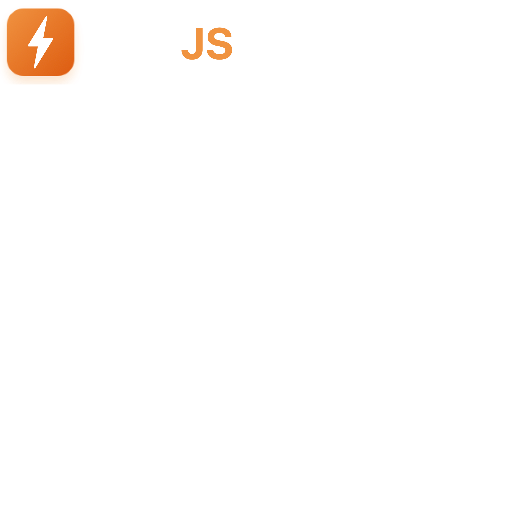

# 

High-performance fullstack React framework with Rust-powered backend. File-based routing, automatic TypeScript bindings, and zero-config development.

## Architecture

```
Client (React) → File Routes → TypeScript Handlers
                                    ↓
                              IPC Protocol
                                    ↓
                          Rust HTTP Server (9ns routing)
```

## API

### Client
```javascript
import { router, middleware, errors, logger, types } from '@zap-js/client'
```

### Server
```javascript
import { rpc, ipc, types } from '@zap-js/server'
```

### File Routes
```
routes/
├── index.tsx          → /
├── blog/[slug].tsx    → /blog/:slug
├── api/users.ts       → /api/users     # export GET, POST, etc.
├── _layout.tsx        → Nested layout
└── ws/chat.ts         → WebSocket endpoint
```

### Route Handlers
```javascript
// routes/api/users.ts
import { rpc } from '@zap-js/server'

export async function GET(req) {
  const users = await rpc.call('getUsers')
  return Response.json(users)
}

// routes/blog/[slug].tsx
import { router } from '@zap-js/client'

export default function BlogPost() {
  const { slug } = router.useParams()
  return <article>...</article>
}
```

## Features


- **Type-safe RPC** with automatic TypeScript generation
- **Nested layouts** with `_layout.tsx` files
- **Route middleware** for auth, logging, data preloading
- **SSG support** via `generateStaticParams`
- **WebSocket routes** with typed handlers
- **Hot module reload** with Rust rebuild detection
- **Production builds** with code splitting and optimization

## Quick Start

```bash
zap new my-app
cd my-app
npm run dev     # Start dev server on :3000
npm run build   # Production build
```

## CLI Commands

```bash
zap new <name>    # Create new project
zap dev          # Development server with HMR
zap build        # Production build
zap routes       # Display route tree
zap codegen      # Generate TypeScript from Rust exports
```

## License

MIT © ZapJS
