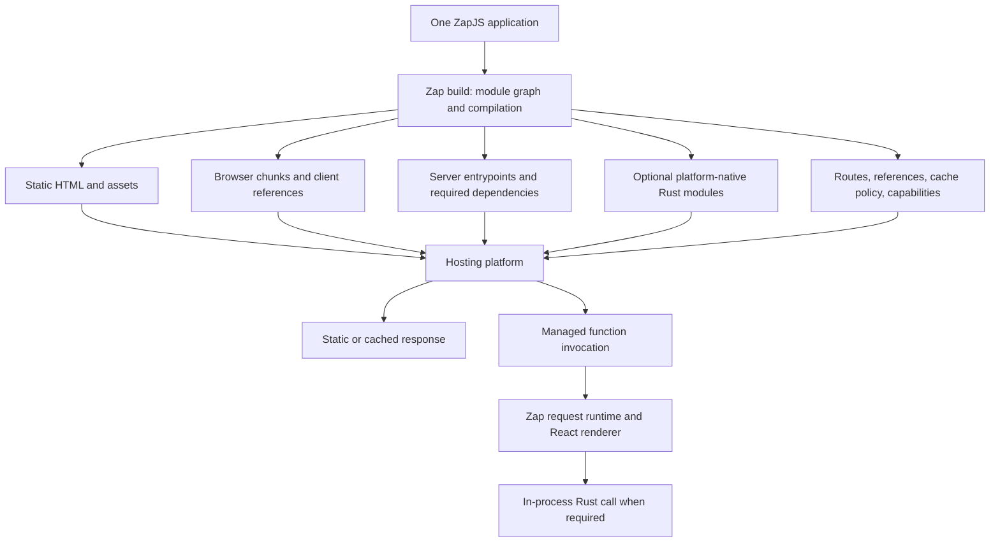

# ZapJS framework architecture

Date: September 30, 2026
Status: implemented and verified on the initial Vercel Node target. See ../implementation.md for evidence, supported limits and remaining product work.

ZapJS uses one compiler-led React application and managed deployment output. The obsolete Rust HTTP server, supervisor, socket transports, platform executables, and standalone backend templates have been removed.

## Product contract

ZapJS is an integrated React full-stack framework with the core development and deployment model of Next.js. Developers create one application, develop it with `zap dev`, build with `zap build`, and deploy the generated output through their hosting platform. Pages, server components, client components, route handlers, server functions, assets, and cache behavior belong to that application.

Production deployment must not require a separately provisioned backend, application-managed Rust HTTP listener, persistent Splice supervisor, or Unix sockets. Dynamic requests still execute server-side code: the hosting platform provides that execution environment and request lifecycle.

The design prioritizes managed deployment, React compatibility, efficient build output, fast rendering/navigation, low cold-start cost, and predictable latency under load. No design can be called the universally fastest without measuring representative workloads on its target platform.

## Selected design

Use a compiler-led architecture with a small JavaScript framework runtime and selective Rust acceleration. The primary dynamic target is a managed Node.js-compatible function runtime. Static content goes to the host's static/CDN output. Rust application code, when used, is compiled into a native module loaded inside the relevant function instance.



The dynamic request path is platform invocation → Zap handler → React/TypeScript → optional in-process Rust → streaming response. A native call does not require a network request, socket, supervisor, or separate worker process. A cache hit or prerendered page can avoid dynamic execution entirely.

This is the implemented architecture. Node-API calls still incur value conversion, allocation, asynchronous scheduling, module loading, and native binary size costs; native execution is not automatically faster than JavaScript.

## Framework core

### One authoritative module and route graph

The build graph owns route matching and layout hierarchy, server/client module boundaries, server function references, assets, dependencies, and deployment capabilities. Generate runtime manifests and references from this graph. Development and production must use the same semantics.

The build must reject server-only/native imports from browser modules. A Rust export is callable by server code; it does not automatically become a public HTTP endpoint. Public server-function invocations need explicit generated endpoints with validation, request context, authorization hooks, and appropriate cross-origin protections.

Reuse existing parser, compiler, bundler, and React integration components behind this graph. Do not implement another JavaScript engine or renderer. Retain existing Vite infrastructure only where it demonstrably meets the graph and React integration contract; adding an SSR flag alone does not implement React Server Components.

### React rendering and navigation

Treat modern Next.js/App Router semantics as the reference for the core: server/client separation, nested routes/layouts, initial HTML rendering, streamed server-component payloads, client hydration, client navigation, pending/error boundaries, and server-side mutations. Feature breadth can grow incrementally, but these boundaries must be coherent from the start.

Use React's actual server rendering and Server Component infrastructure. RSC execution and HTML SSR are distinct phases, even when hosted in the same function instance. The browser's reference manifest must identify the exact client chunks emitted by that build. Navigation must reuse the same route/reference model as initial rendering.

Pin the React/framework-integration versions and test them together: React documents that the APIs used to build RSC frameworks do not follow semver across React 19 minor releases. The implementation pins React 19.3.0 and its RSC integration; framework tests exercise both streamed HTML and Flight.

Use streaming with backpressure and request abort propagation throughout rendering and the deployment adapter. Do not buffer a complete HTML or server-component response just to fit a JSON message protocol.

### Request runtime

Expose a platform-neutral handler contract around Web Request/Response, streaming bytes, request context, abort/deadline information, and host capabilities. Platform adapters translate this into their entrypoint interface. This is a contract boundary; avoid repeatedly converting full request/response objects between wrappers.

The runtime owns route dispatch, request-scoped deduplication, rendering, server-function dispatch, and typed error handling. The hosting platform owns public HTTP termination, instance scheduling, and process lifecycle. Shared infrastructure must not assume that memory or local disk persists between instances.

Keep JavaScript I/O in the normal asynchronous runtime. Rust should be used for measured CPU-intensive work and existing native application logic. Do not cross the native boundary for every header lookup, middleware stage, or component render.

## Rust native integration

Rust has two useful roles here:

1. Build tools: graph analysis, transformations, code generation, hashing, incremental work, and native application compilation where they improve measured build performance.
2. Runtime libraries: substantial CPU-intensive operations and user Rust exports invoked through generated in-process bindings.

Use Node-API as the initial native interface for supported Node-based deployments. Generate bindings with one authoritative type/schema definition shared by Rust and TypeScript. Keep ordinary arguments typed; avoid converting objects through JSON strings merely to bridge languages. Use byte buffers for binary data where ownership/lifetime rules permit. Define integer precision, nullability, result errors, context, and cancellation explicitly.

Expensive native calls must be asynchronous with bounded outstanding work. Native execution must not block the JavaScript event loop. Batching should amortize boundary costs where requests already have multiple related operations. Native failures share the function's process boundary; removing process isolation is a deliberate tradeoff.

Rust signatures compiled by napi-rs are the binding authority. The packaged zap-native library supplies bounded CPU admission and cooperative cancellation. There is no runtime IPC invocation backend.

Development native rebuilds may require restarting a local framework runtime to avoid loading stale native code. That remains internal to `zap dev`; production does not depend on a development process manager.

Bun compatibility must be verified separately. Its documentation says most Node-API extensions work; that is not a guarantee for every native module or API used by ZapJS.

## Build artifacts and managed deployment

Use an internal output contract such as:

```text
.zap/output/
  manifest.json       # schema/build version, routes, references, capabilities
  static/             # prerendered HTML, public assets, immutable browser chunks
  server/             # traced server entrypoints and their dependency closures
  ssr/                # React HTML renderer and client-component SSR chunks
  native/             # native modules only for entrypoints that need them
```

These are the internal output names. A deployment adapter lowers them into the platform's required layout. Do not require platforms to understand Zap's internal directories directly.

Use Vercel's documented Build Output API as the first concrete managed-deployment integration: emit static assets, function entrypoints/configuration, routing, and applicable prerender/cache metadata. This is one application deployment, even if the platform packages several internal function entrypoints. Supporting this format is not automatic Next.js detection or feature parity.

The initial adapter emits one dynamic function with lazy route chunks. Future function partitioning must use measured dependency sets and runtime requirements: one giant eagerly loaded bundle increases cold-start and memory costs, while a function for every tiny module duplicates initialization and dependencies. Calls between server modules within a request stay local unless the application explicitly calls an external service.

Compile native artifacts for the actual deployment OS, architecture, libc, and supported Node-API version. A developer's macOS binary is not a Linux deployment artifact. JavaScript-only projects use prebuilt build tools and must not require authors to maintain a Rust toolchain. Projects with Rust source compile it during the build, never on a live request.

Edge-isolate execution is a separate capability target. A native `.node` module cannot be assumed available there. A supported Rust subset may have a WASM backend, but filesystem, network, threads, dependencies, memory, and cancellation semantics must be validated. Reject unsupported target/module combinations at build time. Never silently introduce a remote Rust service to simulate compatibility.

Cache policy is part of the output contract: request-local deduplication, public route output, private/user-specific output, invalidation tags, and build/deployment versioning. Persistent shared caching is adapter-backed. A process-local cache is only an optimization, never the sole source of truth for cross-instance invalidation.

## Performance priorities

Optimize in this order, revisiting the order when measurements identify a different bottleneck:

1. Avoid request-time work through correct prerendering and public caching. Keep personalized responses isolated.
2. Send less browser JavaScript using server/client boundaries, route splitting, and dependency elimination.
3. Remove render/data waterfalls where operations are independent; deduplicate work per request.
4. Stream useful output early with backpressure. Measure both first-byte and complete-response performance.
5. Keep dynamic server code in one invocation; remove mandatory IPC hops and repeated serialization.
6. Control cold starts through dependency tracing, lazy initialization, selective native inclusion, and measured route grouping.
7. Accelerate substantial measured CPU work in Rust with bounded scheduling and appropriately sized calls.
8. Optimize allocation, copying, lookup, and codecs only when profiling shows their material contribution.

A nanosecond router lookup is not evidence of better page latency. The repository's historical IPC round-trip microbenchmark measures encode/decode, not the multi-process request path. Existing correctness traces are not performance results.

## Migration and release gates

The original process implementation has been replaced. These gates define completion; a source change or isolated passing test alone is not sufficient.

1. Establish the core graph, server/client entrypoint contracts, versioned manifests, and supported runtime matrix. Keep current routes/Rust functions as migration fixtures.
2. Build one real managed-deployment vertical slice: a nested React page with a server component, an interactive client component, streamed dynamic data, an API route, and a Rust call through native bindings.
3. Deploy generated artifacts through the managed adapter. Verify cold invocation, instance reuse, native packaging, request aborts, static assets, and response streaming on that platform.
4. Extend development HMR/rebuild and production rendering against the same graph. Verify Rust build errors and recovery without exposing runtime processes to users.
5. Port the existing context/error/cancellation/codegen tests to native bindings. Remove the production IPC chain once the replacement meets those contracts.
6. Add cache invalidation, multiple-instance, deployment-version, and failure tests. Complete the project generator against this exact output model.

Acceptance must include actual Aegis browser tests for initial render, hydration, nested/dynamic navigation, pending/error boundaries, and mutations. Fozzy host-backed scenarios should record real build/deploy-validation commands; strict process stubs must not be presented as application behavior.

Performance comparison must use equivalent application behavior, payloads, cache states, runtime resources, deployment region, and offered load. Compare against a pinned Next.js version and the relevant JavaScript/native alternatives. Include static hits, uncached streamed React rendering, database-backed pages, and CPU-heavy Rust functions. Measure cold and warm latency, p50/p95/p99, errors, CPU, memory, transferred client JS, user-visible rendering, build/HMR time, and throughput at a stated latency SLO. Set numeric budgets from an actual baseline; do not invent a speedup target and call it measured.

No claim of maximum performance or hosting compatibility is accepted solely from this document. Current verification evidence, supported capabilities, and limits are recorded in [implementation.md](../implementation.md). The broader performance matrix above remains the standard for future performance claims; a local synthetic comparison does not establish every workload's behavior.

## Primary references checked

- [React Server Components](https://react.dev/reference/rsc/server-components): component boundaries and framework version constraints.
- [React streaming renderer](https://react.dev/reference/react-dom/server/renderToReadableStream): streamed HTML rendering in Web Stream environments.
- [Node-API](https://nodejs.org/api/n-api.html): native ABI, asynchronous work, thread restrictions, and native lifetimes.
- [Bun Node-API](https://bun.sh/docs/runtime/node-api): separately testable compatibility rather than assumed parity.
- [Vercel Build Output API](https://vercel.com/docs/build-output-api): framework build outputs and native platform constraints.
- [Vercel output primitives](https://vercel.com/docs/build-output-api/primitives): static assets, function entrypoints, and prerender outputs.
- [Next.js deployment adapters](https://nextjs.org/docs/app/api-reference/adapters): build/runtime integration model.
