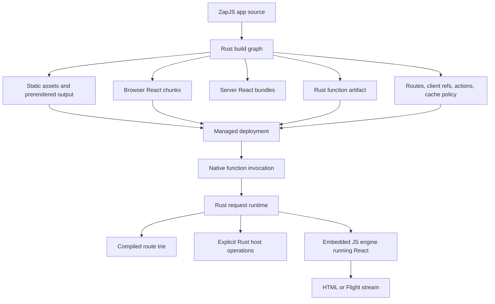

# ZapJS framework architecture

Date: September 30, 2026
Status: Rust-owned implementation in progress.

## Product contract

ZapJS is a Next.js-style integrated React framework whose runtime and tooling are owned by Rust. The user model is still one application: pages, layouts, route handlers, server actions, client assets, server rendering, navigation, cache metadata and deployment output are produced together.

Third-party JavaScript source may be bundled as input, while the product runtime remains the Rust-owned React graph, request runtime, renderer host and managed artifact output.

React remains real React. Server rendering, React Server Components, hydration and navigation require JavaScript execution, so Rust embeds and controls a JavaScript engine with explicit host capabilities. Rust owns request admission, routing, I/O, resource limits, cancellation, explicit host operations, build orchestration, deployment packaging and validation.

## Runtime shape

The deployment contains static browser assets and Rust-managed function artifacts under one application/project. Dynamic requests enter the hosting platform's managed native function process. Inside that process, ZapJS dispatches routes, applies Rust-owned admission, runs the embedded React renderer when needed, invokes explicit host operations and enforces response streaming/resource limits.

Splice is internal infrastructure for Rust-owned process isolation and replacement. Production may use direct in-process Rust calls where isolation is not needed; development and selected production boundaries can use Splice workers when the lifecycle and failure semantics are explicitly supported.

## Build graph

One authoritative graph owns route hierarchy, layouts, client/server boundaries, action references, assets, dependency resolution, cache policy and deployment capabilities. Development and production must use the same graph semantics.

The Rust build path compiles TypeScript and TSX through Rust libraries. Server bundles target the embedded engine; browser bundles target Web modules. The graph must reject unsupported server-only imports in browser code and unsupported browser capabilities in server-only code. Produced artifacts cannot rely on unresolved platform imports, ambient globals or compatibility polyfills.

React Server Components require separate handling from HTML SSR. Flight references, browser client references, server action identity, build IDs and hydration inputs must all come from the same manifest. A static SSR demonstration is not proof of the full framework path.

## Request runtime

The runtime contract is platform-neutral: method, URL, headers, body stream, request context, abort signal, deadline, response headers and response byte stream. The managed host entrypoint is lowered directly into this contract.

Rust owns:

- route dispatch through a compiled route trie;
- request-scoped context, body limits and cancellation;
- server action and route handler admission;
- explicit Rust host operations and admitted action/handler dispatch;
- explicit host calls available to React server bundles;
- streaming response backpressure;
- typed error boundaries at routing, rendering and function boundaries.

The embedded JavaScript context receives only the Web primitives and host operations ZapJS installs. Host calls are named, typed at the framework boundary and bounded by deadline/output limits.

## Splice contract

Splice version 2 is a bounded Rust-to-Rust transport for trusted worker boundaries. The restored implementation currently supports unary invocation, typed remote errors, negotiated frame limits, bounded in-flight requests, deadlines, cancellation and connection-failure cleanup. It deliberately does not advertise streaming until credit-based stream backpressure is implemented and tested.

The framework owns socket creation, subprocess supervision, worker replacement, authentication assumptions and deployment policy. A disconnected worker cancels in-flight calls; requests are not silently retried unless a higher framework layer explicitly makes an idempotent retry decision.

## Managed deployment

The target deployment model mirrors the managed shape of Next.js: one project output lowered into the host's supported artifact layout. Static assets go to static/CDN output. Dynamic code runs in native managed function artifacts owned by the ZapJS build output.

The target platform remains a managed native-function host. ZapJS must produce and upload native build-output artifacts directly, then verify the deployed artifact and process runtime.

## Performance policy

The architecture starts by removing request-time work and measuring the remaining path. ZapJS optimizes in this order:

1. prerender and cache public output correctly;
2. reduce browser JavaScript through server/client boundaries;
3. avoid render and data waterfalls;
4. stream early only on paths with tested backpressure and abort propagation;
5. avoid mandatory IPC for ordinary request work;
6. control cold starts through dependency tracing and lazy initialization;
7. use Rust for measured CPU-heavy work;
8. optimize codecs, allocation and lookup paths when profiles show they matter.

No isolated router timing, IPC round-trip, isolated SSR proof or local synthetic result establishes production superiority. Production claims require equivalent workloads, pinned Next.js comparison, cold/warm latency, p50/p95/p99, memory, CPU, throughput, client JS transferred, build/HMR time and error rates under a stated load/SLO.

## Current implementation evidence

The current Rust layer includes:

- `zap-runtime`: compiled route parsing and lookup with unsafe URL path rejection, manifest source/bundle path and route/action source identity validation, route/action module-kind validation, server-action identity validation, route-handler method validation, client/server bundle boundary validation, GET-to-HEAD route-handler admission, request id/auth/deadline and cache/privacy policy admission and cache policy validation, cache-control header decisions.
- `zap-splice`: bounded Rust worker transport with cancellation, deadlines, crash cleanup and subprocess coverage.
- `zap-render`: Rust-owned QuickJS execution with Web Stream, route/action `Response` support, response status/header validation, typed execution failures, explicit host calls, output limits and CPU interruption.
- `zap-build`: Rust-only TSX bundling through Rolldown/Oxc for server IIFE and browser module outputs, typed callable export discovery for actions and route handlers plus typed local named export-list cache metadata discovery, re-export list exclusion until explicit graph resolution exists, GET-to-HEAD route-handler method derivation, generated GET fallback for HEAD route-handler bundles, duplicate graph module ID rejection, unsupported platform-module rejection, ambient platform-global rejection across direct, optional, literal and statically computed bracketed, probe and destructured references, static template module-specifier scanning, local type-only import/export elision, dependency-only helper/type module exclusion, non-static dynamic-import rejection, regex-literal and non-reference identifier false-positive protection and strict cache export and policy validation.
- `zap-cli`: native `zap check` and `zap build` commands over the Rust graph/build path with explicit app/public/output options and summaries.

This is foundation work, not a full production framework claim.

## Release gates

ZapJS can make a production claim only after these gates are executable and recorded:

1. real React HTML SSR and Flight run through the Rust-owned engine with cancellation, streaming and memory limits;
2. the Rust graph emits matching server bundles, browser chunks, client references, action IDs and route manifests;
3. hydration, client navigation, pending/error boundaries and React-wired server actions are verified in Aegis;
4. application route handlers and server actions execute through the Rust-owned runtime with explicit body/input/context limits and application-specific authorization hooks;
5. Splice adds tested streaming only if the framework needs a streaming worker boundary;
6. native managed deployment artifacts are produced and verified on the target platform;
7. the remaining development and deploy commands run through the Rust toolchain;
8. the landing site and docs are ported after the implementation supports the claims they make.

Verification evidence belongs in executable tests, Fozzy traces and deployment artifacts. Documentation must describe the implemented boundary and the remaining gates separately.
